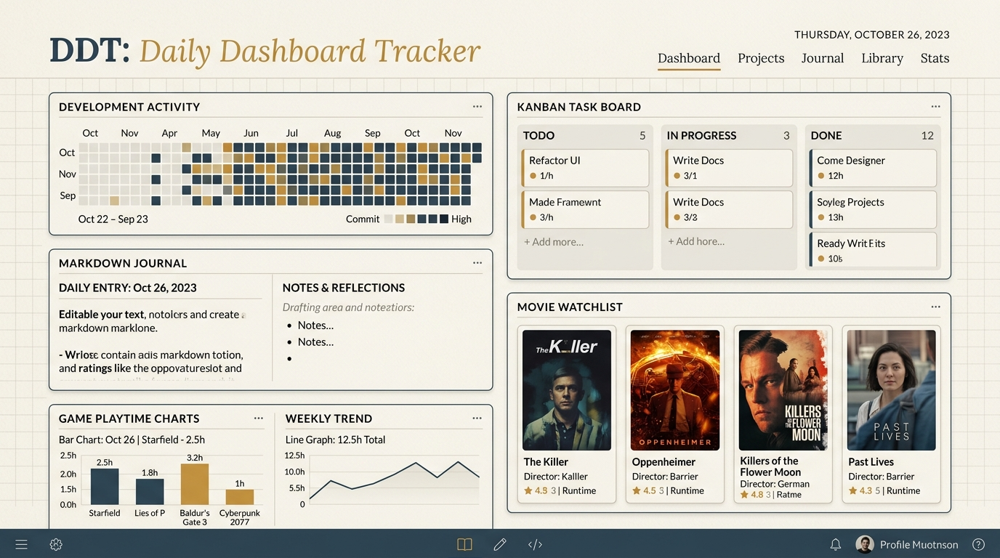

<div align="center">

  

  # DDT — Daily Dashboard Tracker
  
  **A local-first, privacy-respecting personal field notebook & daily ledger dashboard.**  
  *Runs entirely on `127.0.0.1` • 100% offline-capable • Zero telemetry • Single SQLite database*

  <p align="center">
    <a href="#-quick-start"></a>
    <a href="#-tech-stack"></a>
    <a href="#-tech-stack"></a>
    <a href="#-tech-stack"></a>
    <a href="#-tech-stack"></a>
    <a href="#-privacy--local-first"></a>
    <a href="#-privacy--local-first"></a>
  </p>

</div>

---

## 🎬 Video Preview & Interface Walkthrough

<div align="center">
  <a href="#-modules--features">
    
  </a>
  <p align="center">
    <sub><i>▶️ Click the preview above to explore the interactive modules. (Walkthrough video preview mock player)</i></sub>
  </p>
</div>

<details>
<summary><b>📺 Expand Interactive Video Player (Demo Preview)</b></summary>

<br />

```html
<!-- DDT Video Walkthrough Player -->
<video width="100%" poster="docs/preview.png" controls preload="metadata">
  <source src="https://commondatastorage.googleapis.com/gtv-videos-bucket/sample/BigBuckBunny.mp4" type="video/mp4">
  Your browser does not support the video tag.
</video>
```

</details>

---

## 🧭 Why DDT?

Most modern dashboard apps require mandatory cloud logins, track user metrics, rent your data back to you across subscription tiers, and feel like generic SaaS templates.

**DDT (Daily Dashboard Tracker)** is built with a different philosophy:
- **🔒 100% Local-First:** Your journals, habits, tasks, movie watchlists, and gaming records live in a single SQLite database (`~/.ddt/data.db`) on your physical disk.
- **⚡ Instantaneous Speeds:** Zero cloud roundtrips, sub-millisecond local queries, and optimistic client writes.
- **📖 Field Notebook Aesthetic:** Quiet, typography-first interface crafted with warm paper (`#F6F4EE`), deep ledger ink (`#232019`), machined hairline rules, and the signature **Dot-Ledger** activity strip.
- **🛡️ Client-Stored API Keys:** Optional keys for GitHub GraphQL, TMDB, and RAWG are encrypted locally in your database and called directly from your machine.

---

## 🍱 Modules & Features

```
┌─────────────────────────────────────────────────────────────────────────────┐
│                            DAILY DASHBOARD BENTO                            │
├──────────────────────┬──────────────────────┬───────────────────────────────┤
│  🐙 DEV ACTIVITY     │  📋 KANBAN BOARD     │  📖 FIELD JOURNAL             │
│  12-mo commit graph  │  dnd-kit drag & drop │  Split-pane live markdown     │
│  Recent push stream  │  Monospace due dates │  Debounced auto-save          │
├──────────────────────┼──────────────────────┴───────────────────────────────┤
│  🎬 WATCHLIST RADAR  │  🎮 GAME PLAYTIME LOG       🍽️ DAILY MEAL LOG        │
│  Theatrical counter  │  RAWG metadata & covers     Breakfast/Lunch/Dinner   │
│  Want/Watching grid  │  Weekly playtime trend      30-day dot ledger trail  │
└──────────────────────┴──────────────────────────────────────────────────────┘
```

### 1. 📊 Daily Bento Dashboard
- **Single Pane of Glass:** Aggregates today's GitHub square, active journal prompt, next 2 due Kanban tasks, upcoming movie theatrical releases, and meal status toggles.
- **Header Dot-Ledger:** Displays a 30-day sequential intensity strip on desktop and a compact 14-day strip on mobile viewports.

### 2. 🐙 Dev & GitHub Tracker
- **12-Month Contribution Heatmap:** High-density GitHub GraphQL activity grid rendered with hover metrics in JetBrains Mono.
- **Commit Stream Feed:** Instant visibility into your latest repository pushes with smart in-memory TTL caching.

### 3. 📋 Drag-and-Drop Kanban
- **Fluid Task Management:** Powered by `@dnd-kit` with collision detection and keyboard navigation.
- **Visual Priority Tags:** Subtle colored dot indicators (Bug/Urgent in Stamp Red, Feature in Ledger Blue, Ops in Gold).
- **Data Safety:** Deletion confirmation dialogs prevent accidental task loss on misclicks.

### 4. 📖 Field Journal & Notes
- **Split-Pane Markdown Editor:** Real-time side-by-side editing with formatted preview support (headings, code blocks, lists, blockquotes).
- **Debounced Autosave:** Background persistence (~1.5s debounce) with an unobtrusive sync indicator and live word count.

### 5. 🎬 Movie & TV Watchlist
- **Theatrical Release Radar:** Real-time countdown badges (`In theaters Sep 12`, `In theaters in 3 days`) for upcoming theatrical premieres.
- **TMDB Search & Cover Uploads:** One-click metadata fetch with custom poster art upload overrides.

### 6. 🎮 Gaming Playtime Logger
- **Session Duration Calculator:** Log decimal hours (`2.5h`) or duration clocks (`2h 30m`) with quick increments (`+0.5h`, `+1h`, `+5h`).
- **RAWG Library Sync:** Automatically pull game box art or upload custom artwork from your PC.

### 7. 🍽️ Daily Meal & Nutrition Log
- **Four-Category Logging:** Breakfast, Lunch, Dinner, and Snack sections with accessible Want vs. Eaten checkboxes.
- **Activity Streak:** Independent 30-day dot ledger tracking eating consistency.

---

## 🎨 Theme Engine (6 Handcrafted Aesthetics)

DDT includes 6 meticulously balanced themes accessible from the top-bar dropdown or the collapsed sidebar rail:

| Theme | Type | Base Paper | Accent Tone | Description |
| :--- | :---: | :---: | :---: | :--- |
| ☀️ **Field Ledger** | `Light` | `#F6F4EE` | `#2F4858` | Warm paper & ink field logbook *(Default)* |
| 📜 **Vintage Sepia** | `Light` | `#F4EEDA` | `#8C4A2F` | Antique parchment & leather library binding |
| 🌙 **Kinetic Dark** | `Dark` | `#09090B` | `#DFE104` | High-energy brutalism with acid yellow |
| ⚡ **Cyberpunk Night** | `Dark` | `#07070E` | `#00F0FF` | Midnight indigo glow with neon cyan & magenta |
| 🍃 **Matcha Forest** | `Dark` | `#111915` | `#4ADE80` | Earthy botanical dark green with sage rules |
| ❄️ **Nordic Frost** | `Dark` | `#1E222A` | `#88C0D0` | Arctic slate chill with polar cyan |

---

## 🚀 Quick Start

### Prerequisites
- **Node.js** `>= 18.0.0`
- **pnpm** `>= 8.0.0` (or `npm`)

### 1. Installation

```bash
# Clone repository
git clone https://github.com/yanhaizhou21-a11y/DDT.git
cd DDT

# Install monorepo dependencies
pnpm install

# Build all packages (server, web SPA, CLI)
pnpm build
```

### 2. Launch DDT

```bash
# Launch server & open browser automatically via CLI binary
pnpm start

# Or launch development servers with hot-module reload:
pnpm dev:server   # API Server on http://127.0.0.1:3001
pnpm dev:web      # Web UI on http://127.0.0.1:3000
```

---

## 📦 Monorepo Architecture

```
DDT/
├── packages/
│   ├── server/           # Express + SQLite (@libsql/client + Drizzle ORM) + Proxies
│   │   ├── src/db/       # SQLite schema definitions & migrations
│   │   └── src/routes/   # REST API routes (habits, kanban, journal, games, movies)
│   ├── web/              # React 18 SPA + Vite + Tailwind CSS + Lucide + motion
│   │   ├── src/pages/    # Dashboard, Dev, Watchlist, Kanban, Journal, Food, Games, Settings
│   │   └── src/components# Dropdowns, Modals, DotLedger, Magnetic, ThemeToggle
│   └── cli/              # Standalone executable CLI binary (`bin: { "ddt": "./dist/cli.js" }`)
├── docs/                 # Documentation assets, preview screenshots & mascots
├── DDT-PRD.md            # Product Requirements & Behavioral Specifications
├── DDT-design.md         # Design System Token Architecture
└── README.md
```

---

## ⌨️ Keyboard Shortcuts

| Shortcut | Scope | Action |
| :--- | :--- | :--- |
| `Ctrl` + `Z` | Journal | Undo markdown edit |
| `Ctrl` + `Shift` + `Z` | Journal | Redo markdown edit |
| `Ctrl` + `B` | Journal | Toggle **bold** text |
| `Ctrl` + `I` | Journal | Toggle *italic* text |
| `Esc` | Global | Close any modal, dropdown, or confirmation dialog |
| `↑` / `↓` | Theme Menu | Navigate themes in dropdown |
| `Enter` / `Space` | Theme Menu | Select active theme |

---

## 🔒 Privacy & Local Storage

- **Database Location:** All data is safely stored in `~/.ddt/data.db`. You can customize this path using the `DDT_DB_PATH` environment variable or the `--db` flag.
- **Portability:** Export and import full database JSON snapshots directly inside **Settings > Database Portability**.
- **Network Boundaries:** DDT makes zero outbound network requests without your explicit key configuration.

---

<div align="center">
  <sub>Crafted with care for private, reflective daily tracking. Released under the <a href="LICENSE">MIT License</a>.</sub>
</div>

