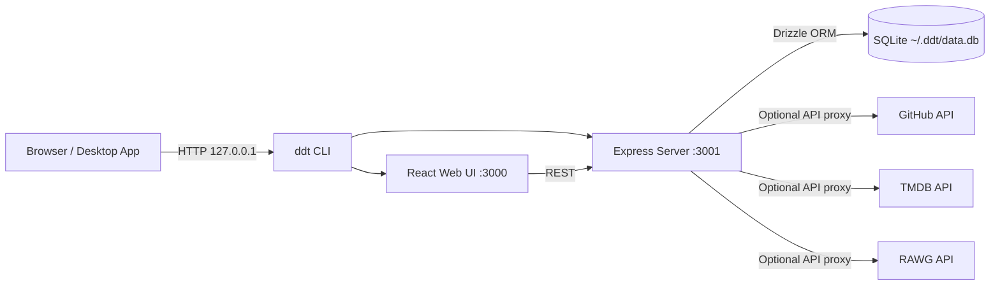

<div align="center">

  

  <h1>DDT: Daily Dashboard Tracker</h1>

  <p align="center">
    A local-first personal ledger for your daily work and life:
    <br/>
    commits, tasks, journal, watchlist, meals, and gaming logs. <em>One database. Zero cloud telemetry.</em>
  </p>

  <p>
    <a href="#quick-start"></a>
    <a href="#quick-start"></a>
    <a href="#architecture"></a>
    <a href="#architecture"></a>
    <a href="#desktop-and-mobile-apps"></a>
    <a href="#desktop-and-mobile-apps"></a>
    <a href="#privacy-and-local-storage"></a>
    <a href="LICENSE"></a>
  </p>

</div>

---

## At a glance

<div align="center">
  <a href="#modules-and-features">
    
  </a>
  <p><sub><i>Dev activity, kanban, journal, watchlist, and gaming logs, all loaded directly from your local SQLite database.</i></sub></p>
</div>

DDT is a personal field notebook and dashboard. It runs on `127.0.0.1`, stores all records in a single SQLite database on your computer, and never phones home. Your data stays on your machine. The only outgoing requests are to the third-party APIs you configure with your own keys.

---

## Why DDT

Most trackers require choosing between cloud convenience and local data control. DDT runs entirely offline by default.

| Principle | Practice |
| :--- | :--- |
| **Local-first** | All journals, tasks, habits, and logs stay in `~/.ddt/data.db` on your local drive. No accounts, no subscriptions, no lock-in. |
| **Instant response** | Core actions avoid network calls. Reads run against local SQLite; writes persist to disk immediately. |
| **Tactile interface** | Uses clean paper tones (`#F6F4EE`), dark ink (`#232019`), hairline borders, and an intensity dot-ledger motif across each view. |
| **Private keys** | GitHub, TMDB, and RAWG tokens stay in your local database and run through a server-side proxy. They are never transmitted elsewhere. |
| **Portable data** | Export or restore your entire database as JSON from **Settings -> Database Portability**. |

---

## Modules and features

```
┌─────────────────────────────────────────────────────────────────────────────┐
│                           DAILY LEDGER BENTO                                │
├──────────────────────┬──────────────────────┬───────────────────────────────┤
│    DEV ACTIVITY      │    KANBAN BOARD      │    DAILY JOURNAL              │
│  12-month heatmap    │  dnd-kit drag-drop   │  Markdown templates           │
│  Commit stream       │  Priority dots       │  Debounced autosave (~1.5s)   │
├──────────────────────┼──────────────────────┴───────────────────────────────┤
│    WATCHLIST         │    GAME LOG               MEAL LOG                   │
│  Theater release dates Total hours + trend     Breakfast/Lunch/Dinner/Snack │
│  TMDB posters        │  RAWG cover art          30-day dot-ledger streak    │
└──────────────────────┴──────────────────────────────────────────────────────┘
```

### 1. Dashboard overview
- View today's GitHub contribution tile, quick journal prompts, upcoming kanban cards, and theater releases.
- Full-width contribution calendar with branch selection for main and collaborator branches.
- Intensity streak strip showing 30 days on desktop and 14 days on mobile.

### 2. Magnifying dock navigation
- Powered by spring physics from `motion/react` with icon magnification.
- Tuned for low memory on mobile devices: GPU-accelerated transforms (`scale3d`), smooth horizontal scrolling, and zero CPU usage when untouched.
- Choice between classic sidebar rail and floating dock on desktop viewports.

### 3. Logs changes and roadmap
- Roadmap view displaying planned and in-progress milestones.
- Status filters for Planned, In Progress, Under Review, and Completed items.
- Release history tab detailing version updates and release dates.

### 4. Dev and GitHub tracker
- 12-month contribution heatmap loaded through GitHub GraphQL `contributionsCollection`.
- Recent commit streams for tracked repositories with in-memory TTL caching.
- Collaborator PR and branch commit tracking.
- Safe fallbacks: displays a "Connect GitHub" card when no token is present.

### 5. Kanban board
- Drag-and-drop task lanes built on `@dnd-kit` with collision detection and keyboard navigation.
- Priority indicators: red for urgent bugs, blue for feature tasks, gold for operations.
- Delete confirmations to prevent accidental data loss.

### 6. Daily journal
- Calendar-based daily entries with customizable templates (Daily Standup, Gratitude, Deep Work, Weekly Review).
- Split-pane markdown editor with live preview, word counter, and debounced local autosave.

### 7. Watchlist
- Search movies and TV shows via TMDB with automatic poster and release date matching.
- Theater release badges sorted by upcoming dates.
- Three progress states: Watching, Want to Watch, and Watched.

### 8. Game log
- Record play sessions with decimal hours (`2.5h`) or clock format (`2h 30m`).
- Weekly summaries showing total playtime, top game, and weekly trends.
- Game cover lookup using your personal RAWG API key or local custom image uploads.

### 9. Meal log
- Four daily categories: Breakfast, Lunch, Dinner, and Snacks.
- Separate 30-day dot-ledger streaks for each category.

### 10. Project tracker
- Project cards organized by four disciplines: Software, Graphic Design, Game Development, and Video/Photo.
- Automatic commit sync for linked repositories; manual daily counts for other fields.

---

## Desktop and mobile apps

DDT can run as a browser tab or as an installable standalone application.

### Windows desktop (.exe)
Built with **Tauri v2** using the native Windows WebView2 runtime.
- Standalone portable executable: `dist/desktop/DDT.exe` (~4.35 MB)
- Installer package: `dist/desktop/DDT-Setup.exe` (~2.54 MB)
- Memory consumption: ~30 to 50 MB RAM (significantly lower than typical Electron apps)

Build the desktop executable:
```bash
pnpm build:exe
```

### Mobile app (.apk)
Packaged with **Capacitor** for Android devices.
- Hardware-accelerated touch dock with horizontal swipe navigation.
- Configurable server address in **Settings -> Mobile & Desktop App Connection** so your phone connects directly to your desktop host IP on your local Wi-Fi.

Build or sync the Android assets:
```bash
pnpm build:apk
```

---

## Theme engine

DDT includes multiple themes switchable from the top navigation bar:

| Theme | Type | Canvas | Accent | Characteristics |
| :--- | :---: | :---: | :---: | :--- |
| **Field Ledger** | Light | `#F6F4EE` | `#2F4858` | Warm paper and dark ink (default) |
| **Neo-Brutalism** | High Contrast | `#FFFDF5` | `#FF6B6B` | 4px solid borders, offset shadows, pop palette |
| **Swiss International** | Minimal | `#FFFFFF` | `#FF3000` | Asymmetric grid, uppercase grotesque type, red signal |
| **Terminal CLI** | Dark Mono | `#0A0A0A` | `#33FF00` | Monospace typography, phosphor green, status prompt |
| **Kinetic Dark** | Dark | `#09090B` | `#DFE104` | Charcoal surface with bright yellow accents |
| **Vintage Sepia** | Light | `#F4EEDA` | `#8C4A2F` | Antique parchment and warm leather |
| **Matcha Forest** | Dark | `#111915` | `#4ADE80` | Deep botanical green |
| **Nordic Frost** | Dark | `#1E222A` | `#88C0D0` | Cool slate and arctic cyan |
| **Monochrome** | Minimal | `#000000` | `#FFFFFF` | Strict black and white scale |

---

## Quick start

### Prerequisites
- **Node.js** `>= 18.0.0`
- **pnpm** `>= 8.0.0` (or npm)

### 1. Install and build

```bash
git clone https://github.com/yanhaizhou21-a11y/DDT.git
cd DDT
pnpm install
pnpm build
npm link ./packages/cli
```

### 2. Launch

```bash
ddt
```

Running packages individually during development:

```bash
pnpm dev:server     # API server on http://127.0.0.1:3001
pnpm dev:web        # Web interface on http://127.0.0.1:3000
```

### 3. Type check

```bash
pnpm typecheck
```

### 4. Optional integrations
Open **Settings** to add API keys. Each integration is optional. The application works completely offline without any keys.

| Integration | Purpose |
| :--- | :--- |
| GitHub Personal Access Token (`repo` read, `read:user`) | Heatmap data, commit streams, repository links |
| TMDB API key | Movie and series search, release dates, poster artwork |
| RAWG API key | Video game search and cover artwork |

---

## Architecture

```
DDT/
├── packages/
│   ├── server/          # Express + SQLite (Drizzle ORM) + local API proxies
│   │   ├── src/db/      # Schema, migrations, database queries
│   │   └── src/routes/  # REST endpoints for dashboard, dev, kanban, journal, media
│   ├── web/             # React 19 SPA + Vite + Tailwind CSS + Lucide + motion
│   │   ├── src/pages/   # Dashboard, Dev, Projects, Watchlist, Kanban, Journal, Changes, Settings
│   │   └── src/components/ # Dock, DotLedger, GithubGraph, Modals, RichTextEditor
│   └── cli/             # Global ddt CLI launcher
├── src-tauri/           # Tauri v2 native desktop app configuration (Rust)
├── android/             # Capacitor Android project files
├── scripts/             # PowerShell build scripts for .exe and .apk
├── docs/                # Assets and preview images
└── README.md
```


```mermaid
flowchart LR
    Browser[Browser / Desktop App] -->|HTTP 127.0.0.1| CLI[ddt CLI]
    CLI --> Server[Express Server :3001]
    Server -->|Drizzle ORM| DB[(SQLite ~/.ddt/data.db)]
    Server -->|Optional API proxy| GitHub[GitHub API]
    Server -->|Optional API proxy| TMDB[TMDB API]
    Server -->|Optional API proxy| RAWG[RAWG API]
    WebUI[React Web UI :3000] -->|REST| Server
    CLI --> WebUI
```

---

## Keyboard shortcuts

| Shortcut | Context | Action |
| :--- | :--- | :--- |
| `Ctrl` + `Z` | Journal | Undo edits |
| `Ctrl` + `Shift` + `Z` | Journal | Redo edits |
| `Ctrl` + `B` | Journal | Toggle bold text |
| `Ctrl` + `I` | Journal | Toggle italic text |
| `Escape` | Global | Close open modals and dropdown menus |
| `ArrowUp` / `ArrowDown` | Theme menu | Move between themes |
| `Enter` / `Space` | Theme menu | Apply chosen theme |

---

## Privacy and local storage

- **Database location:** `~/.ddt/data.db` by default. Can be set with `DDT_DB_PATH` or the `--db` parameter.
- **Portability:** Export or import complete JSON backups through **Settings -> Database Portability**.
- **Network activity:** Zero outbound telemetry or background pings. Calls only occur to user-configured APIs.
- **Network binding:** The backend server binds strictly to `127.0.0.1`.

---

## Troubleshooting

| Issue | Cause | Solution |
| :--- | :--- | :--- |
| Command `ddt` not found | CLI package not linked | Run `npm link ./packages/cli` after building |
| Ports 3000 or 3001 in use | Another service is using the port | The CLI detects occupied ports and increments automatically |
| Heatmap displays "Connect GitHub" | No token entered | Enter a personal access token with read permissions in Settings |
| "Not saved" label in journal | Local file write issue | Verify disk write permissions for your `~/.ddt` folder |
| Blank page after update | Outdated build files | Run `pnpm build` again and restart with `ddt` |

---

## Contributing

1. Fork the repository and create your working branch (`git checkout -b feat/your-feature`).
2. Verify code quality with `pnpm build` and `pnpm typecheck`.
3. Submit a pull request describing the changes and context.

---

<div align="center">
  <sub>Released under the <a href="LICENSE">MIT License</a>.</sub>
</div>
