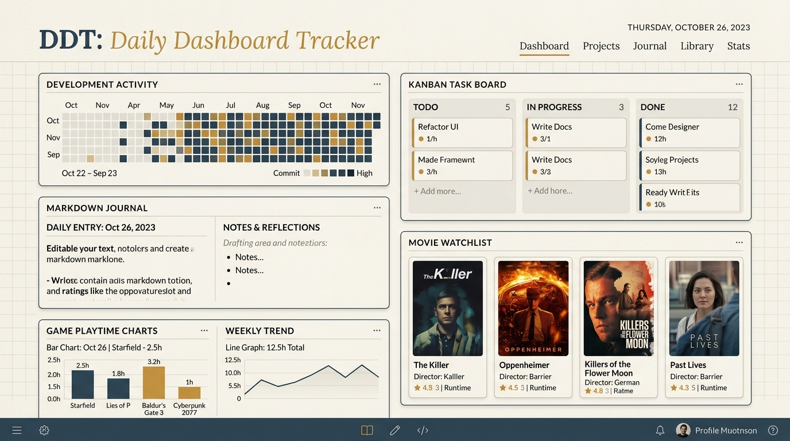
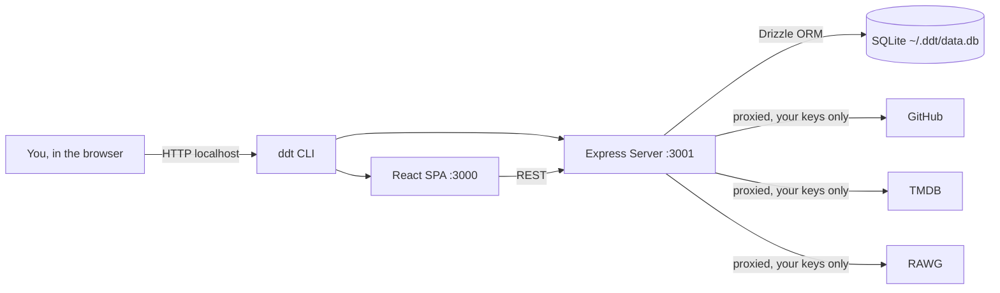

<div align="center">

  

  <h1>DDT — Daily Dashboard Tracker</h1>

  <p align="center">
    A local-first personal ledger for everything your day touches —
    <br/>
    commits, tasks, journal, watchlist, meals &amp; playtime. <em>One database. Zero cloud.</em>
  </p>

  <p>
    <a href="#-quick-start"></a>
    <a href="#-quick-start"></a>
    <a href="#-architecture"></a>
    <a href="#-architecture"></a>
    <a href="#-privacy--local-first"></a>
    <a href="LICENSE"></a>
  </p>

</div>

---

## 🖼️ At a glance

<div align="center">
  <a href="#-modules--features">
    
  </a>
  <p><sub><i>One pane of glass: dev activity, kanban, journal, watchlist and playtime — all rendered from a single local SQLite file.</i></sub></p>
</div>

DDT is a **personal field notebook that happens to be a dashboard**. It runs entirely on `127.0.0.1`, stores everything in one SQLite database on your machine, and never phones home. Your data stays yours — the only outbound requests are the third-party APIs you explicitly opt into with your own keys.

---

## 🧭 Why DDT

Most daily trackers force a tradeoff: **cloud convenience** or **privacy and control**. DDT refuses it.

| Principle | What it means in practice |
| :--- | :--- |
| 🔒 **Local-first** | All journals, tasks, habits and logs live in `~/.ddt/data.db` on your physical disk. No account, no sync, no lock-in. |
| ⚡ **Instant by default** | No network round-trips for core flows. Reads are local queries; writes persist immediately. |
| 📓 **Ledger, not dashboard-SaaS** | Warm paper (`#F6F4EE`), deep ink (`#232019`), hairline rules, and a signature **dot-ledger** motif reused across every module. |
| 🛡️ **Keys stay yours** | GitHub, TMDB and RAWG keys are entered in-app, stored in the local DB, and proxied server-side — never bundled, never logged, never sent anywhere but the API you chose. |
| 📦 **Portable** | Export or move the whole database as JSON from **Settings → Database Portability**. |

---

## 🍱 Modules & features

```
┌─────────────────────────────────────────────────────────────────────────────┐
│                           DAILY LEDGER BENTO                                │
├──────────────────────┬──────────────────────┬───────────────────────────────┤
│  📈 DEV ACTIVITY     │  📋 KANBAN BOARD     │  📓 DAILY JOURNAL             │
│  12-mo heatmap       │  dnd-kit drag&drop   │  Split-pane markdown         │
│  Commit stream       │  Priority dots       │  Debounced autosave (~1.5s)  │
├──────────────────────┼──────────────────────┴───────────────────────────────┤
│  🎬 WATCHLIST        │  🎮 GAME LOG              🍽️ MEAL LOG               │
│  Theater due-dates   │  Hours + weekly trend   Breakfast/Lunch/Dinner/Snack│
│  TMDB posters        │  RAWG cover art         30-day dot-ledger streak    │
└──────────────────────┴──────────────────────────────────────────────────────┘
```

### 1. 📊 Dashboard home — the single pane of glass
- Today's GitHub contribution square, journal prompt, next 2 due kanban cards, upcoming theatrical releases (next 7 days), and quick-add for meals &amp; playtime.
- **Dot-ledger header strip:** a 30-day intensity strip on desktop, compact 14-day version on mobile.

### 2. 🐙 Dev &amp; GitHub tracker
- **12-month contribution heatmap** via GitHub GraphQL `contributionsCollection`, with hover metrics in JetBrains Mono.
- **Recent commit stream** per repository, with in-memory TTL caching (1h contributions / 15m repo list).
- Degrades gracefully: no token configured = a "Connect GitHub" card, never a crash.

### 3. 📋 Kanban board
- Custom columns, drag-and-drop via `@dnd-kit` with collision detection and keyboard support.
- Quiet priority dots (Stamp Red = bug/urgent, Ledger Blue = feature, Gold = ops), monospace due dates.
- Delete confirmations guard against accidental loss.

### 4. 📓 Daily journal
- One markdown entry per calendar day, split-pane live preview.
- Debounced autosave (~1.5s) with an unobtrusive sync indicator and live word count.
- Calendar/list navigation to revisit any past entry.

### 5. 🎬 Watchlist
- TMDB search with automatic poster + release-date fetch; manual freeform entries supported.
- **Theater due-date badges** ("In theaters Sep 12") sorted soonest-first.
- Three states: Watching / Want to watch / Watched.

### 6. 🎮 Game log
- Log sessions as decimals (`2.5h`) or clocks (`2h 30m`) with quick increments.
- Weekly summary: total hours, top game, and a trend line that updates without reload.
- Optional RAWG cover art via your own key; custom artwork uploads supported.

### 7. 🍽️ Meal log
- Breakfast, lunch, dinner, and snack sections with Want vs. Eaten states.
- Independent 30-day dot-ledger streak per category.

### 8. 🗂️ Project tracker
- Per-project cards across four domains: Software, Graphic Design, Game Dev, Video/Photo.
- Status labels adapt to the domain ("Ready to Deploy" vs. "Ready to Ship").
- Linked GitHub repos pull commit activity automatically; everything else falls back to manual daily counts.

---

## 🎨 Theme engine

Six handcrafted themes, switchable from the top bar or the collapsed sidebar rail:

| Theme | Mode | Paper | Accent | Character |
| :--- | :---: | :---: | :---: | :--- |
| ☀️ **Field Ledger** | Light | `#F6F4EE` | `#2F4858` | Warm paper &amp; ink — the default |
| 📜 **Vintage Sepia** | Light | `#F4EEDA` | `#8C4A2F` | Antique parchment &amp; leather |
| 🌙 **Kinetic Dark** | Dark | `#09090B` | `#DFE104` | Brutalist, acid yellow |
| ⚡ **Cyberpunk Night** | Dark | `#07070E` | `#00F0FF` | Indigo glow, neon cyan &amp; magenta |
| 🍃 **Matcha Forest** | Dark | `#111915` | `#4ADE80` | Botanical dark green |
| ❄️ **Nordic Frost** | Dark | `#1E222A` | `#88C0D0` | Arctic slate &amp; polar cyan |

---

## 🚀 Quick start

### Prerequisites
- **Node.js** `>= 18.0.0`
- **pnpm** `>= 8.0.0` (npm works too)

### 1. Install &amp; build

```bash
git clone https://github.com/yanhaizhou21-a11y/DDT.git
cd DDT
pnpm install
pnpm build          # builds server, web SPA, and CLI
npm link ./packages/cli   # exposes the `ddt` command globally
```

### 2. Launch

```bash
ddt                 # boots the local server and opens your browser
```

Or run the pieces separately:

```bash
pnpm dev:server     # API server on http://127.0.0.1:3001
pnpm dev:web        # web UI on http://127.0.0.1:3000
```

### 3. Verify

```bash
pnpm typecheck      # TypeScript across the monorepo
```

### 4. Optional: connect your own APIs
Open **Settings** to add your own keys. Each integration is optional and independently toggleable — the app is fully functional with zero keys configured.

| Integration | Used for |
| :--- | :--- |
| GitHub Personal Access Token (`repo` read, `read:user`) | Contribution heatmap, commit streams, repo-linked projects |
| TMDB API key | Poster art, release dates, watchlist search |
| RAWG API key | Game cover art |

---

## 🏗️ Architecture

```
DDT/
├── packages/
│   ├── server/          # Express + SQLite (Drizzle ORM) + API-key proxies
│   │   ├── src/db/      # Schema, migrations, cache tables
│   │   └── src/routes/  # REST: dashboard, dev, kanban, journal, food, games, movies, projects
│   ├── web/             # React 19 SPA + Vite + Tailwind CSS + Lucide + motion
│   │   ├── src/pages/   # Dashboard, Dev, Projects, Watchlist, Kanban, Journal, Food, Games, Settings
│   │   └── src/components/  # DotLedger, ThemeToggle, Magnetic, Modals, DatePicker, RichTextEditor
│   └── cli/             # `ddt` binary: migrate → start server → open browser
├── docs/                # Logo, preview imagery
├── DDT-PRD.md           # Product requirements & acceptance criteria
├── DDT-design.md        # Design tokens, layout, voice
└── README.md
```


```mermaid
flowchart LR
    U[You, in the browser] -->|HTTP localhost| CLI[ddt CLI]
    CLI --> SVR[Express Server :3001]
    SVR -->|Drizzle ORM| DB[(SQLite ~/.ddt/data.db)]
    SVR -->|proxied, your keys only| GH[GitHub]
    SVR -->|proxied, your keys only| TMDB[TMDB]
    SVR -->|proxied, your keys only| RAWG[RAWG]
    SPA[React SPA :3000] -->|REST| SVR
    CLI --> SPA
```

**Data flow in one line:** your keystrokes → debounced local write → SQLite → instant re-read. Third-party data flows through the server proxy so keys never touch the browser's network tab.

---

## ⌨️ Keyboard shortcuts

| Shortcut | Scope | Action |
| :--- | :--- | :--- |
| `Ctrl` + `Z` | Journal | Undo |
| `Ctrl` + `Shift` + `Z` | Journal | Redo |
| `Ctrl` + `B` | Journal | Toggle **bold** |
| `Ctrl` + `I` | Journal | Toggle *italic* |
| `Esc` | Global | Close any modal, dropdown, or dialog |
| `↑` / `↓` | Theme menu | Navigate themes |
| `Enter` / `Space` | Theme menu | Select theme |

---

## 🔒 Privacy &amp; local storage

- **Database location:** `~/.ddt/data.db` by default. Override with `DDT_DB_PATH` or the `--db` flag.
- **Portability:** export/import full JSON snapshots from **Settings → Database Portability**.
- **Network boundary:** zero outbound requests unless you configure an API key. No telemetry, no analytics, no ads.
- **Binding:** the server listens on `127.0.0.1` only — it never exposes itself on your LAN.

---

## 🛠️ Troubleshooting

| Symptom | Likely cause | Fix |
| :--- | :--- | :--- |
| `ddt` command not found | CLI not linked | Run `npm link ./packages/cli` after `pnpm build` |
| Port 3000/3001 already in use | Another process bound the port | CLI falls back to the next free port automatically |
| Heatmap shows "Connect GitHub" | No token configured | Add a fine-grained PAT in **Settings** with `repo` read + `read:user` |
| "Not saved" indicator in journal | Local write failed | Check disk space / DB path permissions; text is kept in memory |
| Blank screen after build | Stale dist output | Run `pnpm build` again, then `ddt` |

---

## 🤝 Contributing

Contributions are welcome — this project follows a simple flow:

1. **Fork** the repo and create a branch (`git checkout -b feat/your-thing`).
2. **Read** `DDT-PRD.md` for behavior and `DDT-design.md` for tokens, layout, and voice before touching UI.
3. **Build &amp; test** with `pnpm build` and `pnpm typecheck`.
4. **Open a PR** describing what changed and why.

Good first areas to explore: empty states, accessibility passes, the dot-ledger component, and v2 candidates like notifications or nutrition lookup.

---

<div align="center">

  <sub>Crafted for quiet, private, reflective tracking. Released under the <a href="LICENSE">MIT License</a>.</sub>

</div>
